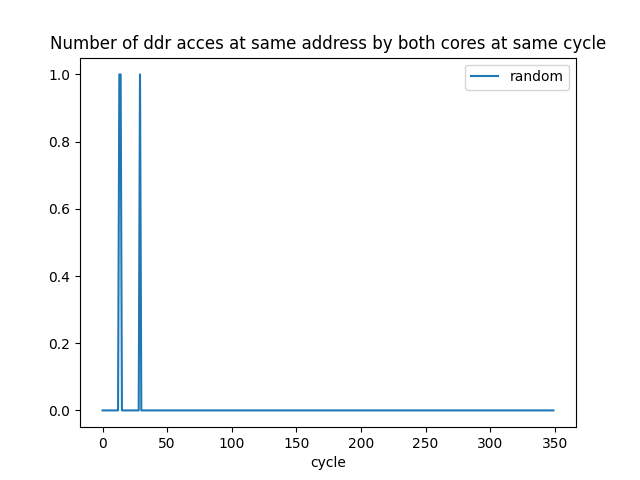
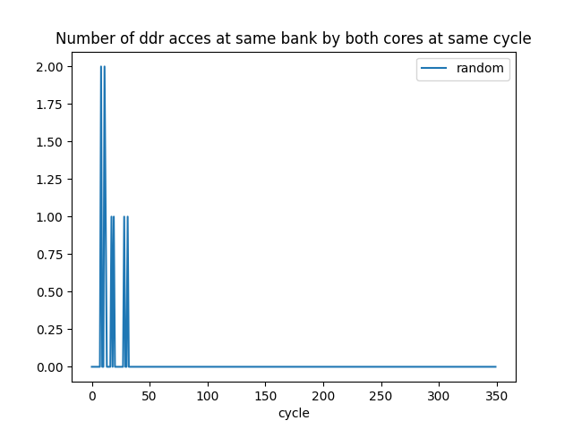
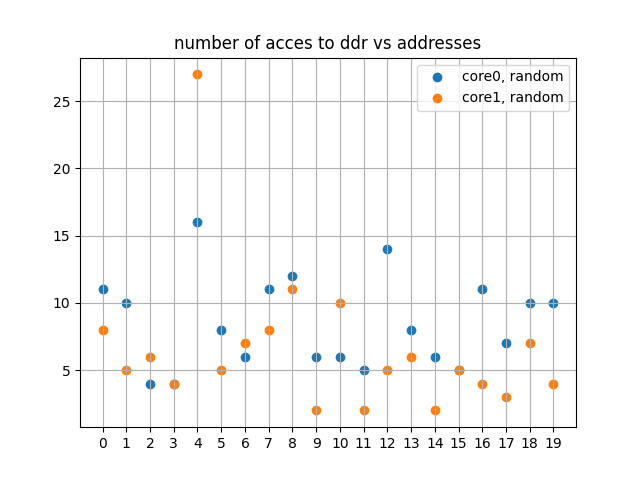
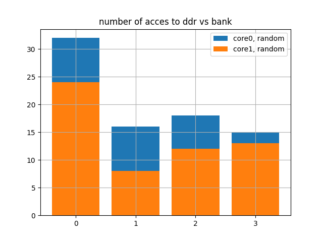

# curiosity-driven-approach

## On going:
I'm currenlty using `sim.class_mem_sim.py` to obtain the following informations:
* Quantifying **contention** with the `sim.class_mem_sim.Interconnect.queue` 
* Link cause to effects, temporal execution time.
* When do simultaneous accesses of **ddr** cache by both cores occur ?  
* What other mechanisms are of interest to users/hardware engineers? acces to same bank in **ddr** at same time ? what delay ? 
* What other mechanisms are responsible for interferences, and which only occur when two applications are run in parallel on both cores?

## Description Simulateur Eric:
 This model represents a memory hierarchy with
 - 3 levels of cache (L1, L2, L3)
 - a DDR memory implemening some simple optimization features (see the DDR class)
 - an interconnect
 The number of cores, levels of cache, characteristics of the cache (number of ways,...)
 are parameters and can be modified.

* `sim.class_mem_sim.CacheLine` represents a single cache line in the cache hierarchy

* `sim.class_mem_sim.PLRU` Pseudo-LRU (PLRU) replacement policy for N-way set associative caches
The pseudoi-LRU is used to determine the bock to replace in case of cache miss.
A binary tree is used to implement the PLRU algorithm. here is one tree per set.

* `sim.class_mem_sim.DDRRequest` represents a memory access request (either read or write)
* `sim.class_mem_sim.Interconnect`: Interconnect model between CPU cores and DDR, with bandwidth and latency
* `sim.class_mem_sim.DDRMemory`:  DDR memory model with banks, row buffers, and latency variations

## Visualisation

For a random exploration we wish to have nice visualisation that show divsersity
 
 
 
 

## IMGEP
We seek to identify a maximum of sources of interference, that is to identify **a maximum of scenarios where shared resources are used simultaneously by the two cores**, here it can only be accessed by the two cores during the same cycle.
