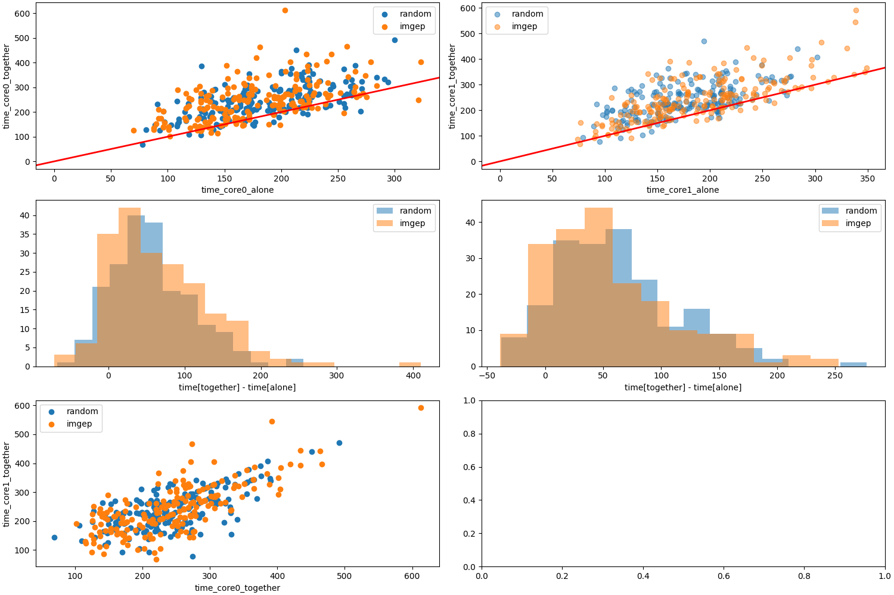

# curiosity-driven-approach

## On going:
* Quantifying **ddr contention** with the `sim.ddr.py` 
* Visualizing these data, and showing the diversity of a set.
## Description Simulateur Eric:
 This model represents a memory hierarchy with
 - 3 levels of cache (L1, L2, L3)
 - a DDR memory implemening some simple optimization features (see the DDR class)
 - an interconnect
 The number of cores, levels of cache, characteristics of the cache (number of ways,...)
 are parameters and can be modified.


* `sim.class_mem_sim.CacheLine` represents a single cache line in the cache hierarchy

* `sim.class_mem_sim.PLRU` Pseudo-LRU (PLRU) replacement policy for N-way set associative caches
The pseudoi-LRU is used to determine the bock to replace in case of cache miss.
A binary tree is used to implement the PLRU algorithm. here is one tree per set.

* `sim.class_mem_sim.DDRRequest` represents a memory access request (either read or write)
* `sim.class_mem_sim.Interconnect`: Interconnect model between CPU cores and DDR, with bandwidth and latency
* `sim.class_mem_sim.DDRMemory`:  DDR memory model with banks, row buffers, and latency variations


## Obvservation space
We seek to identify a maximum of sources of interference, that is to identify **a maximum of scenarios where shared resources are used simultaneously by the two cores**.

Microarchitectural mechanisms are known, and we wish to identify the ones responsible for interferences. A set of relevant performance counters will provide building blocks for the "observation space" O.
Such performance counters can be clock cycles, row misses, instruction types, branch mispredictions, and number of stalls. Thus, an element $o\in O$ of the observation space could be closely related to some micro-architectural mechanisms. An example could be:

```
o =  {ratio[row miss,row hit, (S_1,S_2),bank], 
ratio[row miss,row hit,(S_1,), bank], 
ratio[row miss,row hit,(,S_2), bank],
ratio[stall,cycle,(S_1,S_2)],
ratio[stall,cycle,(S_1,)],
ratio[stall,cycle,(,S_2)],
time[S1, (S_1,S_2)],
time[S2, (S_1,S_2)],
time[S1, (,S_1)],
time[S2, (S_2,)]}
```
**Question : Is such a vector useful to identify micro-architecural mechanisms ?**

## Visualisation

For a random exploration we wish to have nice visualisation that show divsersity with file `visu.py`
Here an exploration of 100 iterations, with random programs of 100 instructions.
default parameters:
```
l1_conf = {'size': 32,  'line_size': 4, 'assoc': 2}
l2_conf = {'size': 128, 'line_size': 4, 'assoc': 4}
l3_conf = {'size': 512, 'line_size': 4, 'assoc': 8}
```
* The first tab of plots shows that there are more **miss** than **hits** when applications $S_{1}$ and $S_{2}$ are running separetly because de ratio is larger in isolation. Moreover, then the right column show that this quantity is "consistent" because most of the time the ratio remains the same for different runs.

* The second tab of plots shows that the execution time for both application is usually larger when running in parallel. 
 
By performing exploration, we would like the white space within the scatter plot to be as covered as possible. Moreover, we would like the diffusion of the histograms to be as high as possible.
## IMGEP
* I would like to perform a modular approach of IMGEP with two modules : 
	* time 
	* miss ratios
* For now, I try to perform an **IMGEP** exploration to explore the only time space using file `test.py`.
### Goal generator
Let's note the cores $c_{0}$ and $c_{1}$.
* Periodically set the sampling boundaries based on the history $\mathcal{H}$:
	* $min T (c_{0}),max T (c_{0}),min T (c_{1}),max T (c_{1}) \leftarrow \mathcal{H}.stats()$
* Sample the time vector $(t_{\cdot,1}(c_{1}),t_{0,\cdot}(c_{0}), t_{0,1}(c_{1}),t_{0,1}(c_{0}))$ in two stages:

	* $(t_{\cdot,1},t_{0,\cdot})\sim (\mathcal{U}([min T (c_{0}), max T (c_{0})]),\mathcal{U}([min T (c_{1}), max T (c_{1})]))$

	* $(t_{0,1}(c_{1}),t_{0,1}(c_{1}))\sim (t_{\cdot,1}(c_{1})\cdot \mathcal{U}([1.0,4.0]),t_{0,\cdot}(c_{0})\cdot \mathcal{U}([1.0,4.0]))$
```python
class GoalGenerator:
    def __init__(self, max_len, num_addr):
        self.num_addr = num_addr
        self.max_len = max_len
        self.k = 0
    def __call__(self,H:History, module="time")->dict:
        if module == "time":
            stats = H.stats()
            if self.k%10==0:
                self.mincore0time = stats["time"]["core0"]["min"]
                self.maxcore0time = stats["time"]["core0"]["max"]
                self.mincore1time = stats["time"]["core1"]["min"] 
                self.maxcore1time = stats["time"]["core1"]["max"] 
                self.k+=1
            times = np.concatenate((np.floor(.5*np.random.randint(self.mincore0time,self.maxcore0time,(1,))),np.floor(4.0*np.random.randint(self.mincore1time,self.maxcore1time,(1,)))))
            delta = np.random.uniform(.6,4.0,(2,))
        times_together = np.floor(delta*times)
        return np.concatenate((times,times_together))
```
### Goal strategy achievement
For a given time goal $g$, I choose to exploit a **kNN** model. That is to select the **k** closest time vectors from our database $\mathcal{H}$. I choose a loss function based on the L2 norm:
${\mathcal{L}}(g)(z) = \sum_{i}{{z_{i} - g_{i}}^{2}$
 ### Results
 
