# Curiosity-driven-approach

## On going:
* Quantifying **ddr contention** with the `sim.ddr.py` 
* Visualizing these data, and showing the diversity of a set.
## Description Simulateur Eric:
 This model represents a memory hierarchy with
 - 3 levels of cache (L1, L2, L3)
 - a DDR memory implemening some simple optimization features (see the DDR class)
 - an interconnect
 The number of cores, levels of cache, characteristics of the cache (number of ways,...)
 are parameters and can be modified.


* `sim.class_mem_sim.CacheLine` represents a single cache line in the cache hierarchy

* `sim.class_mem_sim.PLRU` Pseudo-LRU (PLRU) replacement policy for N-way set associative caches
The pseudoi-LRU is used to determine the bock to replace in case of cache miss.
A binary tree is used to implement the PLRU algorithm. here is one tree per set.

* `sim.class_mem_sim.DDRRequest` represents a memory access request (either read or write)
* `sim.class_mem_sim.Interconnect`: Interconnect model between CPU cores and DDR, with bandwidth and latency
* `sim.class_mem_sim.DDRMemory`:  DDR memory model with banks, row buffers, and latency variations

## Parameter space
Parameters are pair of intruction sequences like below:
I fix the maximum length of the instruction sequences
```python
sequence_core_0 = [{'type': 'r', 'addr': 11, 'core': 0},{'type': 'w', 'addr': 5, 'value': 686, 'core': 0}]
sequence_core_1 = [{'type': 'w', 'addr': 42, 'value': 686, 'core': 1},{'type': 'r', 'addr': 14,  'core': 1}]
```
## Obvservation space
We seek to identify a maximum of sources of interference, that is to identify **a maximum of scenarios where shared resources are used simultaneously by the two cores**.

Microarchitectural mechanisms are known, and we wish to identify the ones responsible for interferences. A set of relevant performance counters will provide building blocks for the "observation space" O.
Such performance counters can be clock cycles, row misses, instruction types, branch mispredictions, and number of stalls. Thus, an element $o\in O$ of the observation space could be closely related to some micro-architectural mechanisms. An example could be:

```
o =  {ratio[row miss,row hit, (S_1,S_2),bank], 
ratio[row miss,row hit,(S_1,), bank], 
ratio[row miss,row hit,(,S_2), bank],
ratio[stall,cycle,(S_1,S_2)],
ratio[stall,cycle,(S_1,)],
ratio[stall,cycle,(,S_2)],
time[S1, (S_1,S_2)],
time[S2, (S_1,S_2)],
time[S1, (,S_1)],
time[S2, (S_2,)]}
```
**Question : Is such a vector useful to identify micro-architecural mechanisms ?**

## Visualisation

For a random exploration we wish to have nice visualisation that show divsersity with file `visu.py`
Here an exploration of 100 iterations, with random programs of 100 instructions.
default parameters:
```
l1_conf = {'size': 32,  'line_size': 4, 'assoc': 2}
l2_conf = {'size': 128, 'line_size': 4, 'assoc': 4}
l3_conf = {'size': 512, 'line_size': 4, 'assoc': 8}
```
* The first tab of plots shows that there are more **miss** than **hits** when applications $S_{1}$ and $S_{2}$ are running separetly because de ratio is larger in isolation. Moreover, then the right column show that this quantity is "consistent" because most of the time the ratio remains the same for different runs.

* The second tab of plots shows that the execution time for both application is usually larger when running in parallel. 
 
By performing exploration, we would like the white space within the scatter plot to be as covered as possible. Moreover, we would like the diffusion of the histograms to be as high as possible.
## IMGEP
* I would like to perform a modular approach of IMGEP with several modules : 
	* time : $(t_{\cdot,1}(c_{1}),t_{0,\cdot}(c_{0}), t_{0,1}(c_{1}),t_{0,1}(c_{0}))\in\mathbb{R}^{4}$
	* time difference core 0: $|(t_{0,\cdot}(c_{0})-(t_{0,1}(c_{0}))|\in\mathbb{R}$
	* time difference core 1: $|(t_{\cdot,1}(c_{1})-(t_{0,1}(c_{1}))|\in\mathbb{R}$
	* miss ratio: $(ratio[(0,\cdot),bk], ratio[(\cdot,1),bk],ratio[(0,1),bk])\in{[0,1]}^{3}, \mbox{with bank } bk\in\\{1,2,3,4\\}$
	* miss ratio in isolation core 0: $ratio[(0,\cdot),bk,rw]\in[0,1], bk\in\\{1,2,3,4\\}, \mbox{row},rw\in\\{1, \cdots,n_{r}\\}$
	* miss ratio in isolation core 1: $ratio[(\cdot,1),bk,rw]\in[0,1], bk\in\\{1,2,3,4\\}, \mbox{row},rw\in\\{1, \cdots,n_{r}\\}$
	* mutual miss ratio: $ratio[(0,1),bk,rw]\in[0,1], bk\in\\{1,2,3,4\\},\mbox{row} in rw\in\\{1, \cdots,n_{r}\\}$
	* miss ratio differences core 0: $|ratio[(0,1),bk] - ratio[(0,\cdot),bk]|, \mbox{with bank } bk\in\\{1,2,3,4\\}$
	* miss ratio differences core 1: $|ratio[(0,1),bk] - ratio[(\cdot,1),bk]|, \mbox{with bank } bk\in\\{1,2,3,4\\}$
   	* $\cdots$
### Goal generator
Let's note the cores $c_{0}$ and $c_{1}$.
* For each module, periodically set the sampling boundaries based on the history $\mathcal{H}$,allowing to sample new goals *e.g*:
	* $min T (c_{0}),max T (c_{0}),min T (c_{1}),max T (c_{1}) \leftarrow \mathcal{H}.stats((t_{\cdot,1}(c_{1}),t_{0,\cdot}(c_{0}), t_{0,1}(c_{1}),t_{0,1}(c_{0})))$
	* Sample the time vector $(t_{\cdot,1}(c_{1}),t_{0,\cdot}(c_{0}), t_{0,1}(c_{1}),t_{0,1}(c_{0}))$ in two stages:

	* $(t_{\cdot,1},t_{0,\cdot})\sim (\mathcal{U}([min T (c_{0}), max T (c_{0})]),\mathcal{U}([min T (c_{1}), max T (c_{1})]))$

	* $(t_{0,1}(c_{1}),t_{0,1}(c_{1}))\sim (t_{\cdot,1}(c_{1})\cdot \mathcal{U}([1.0,4.0]),t_{0,\cdot}(c_{0})\cdot \mathcal{U}([1.0,4.0]))$
* I use an instrinsic reward...
### Goal strategy achievement
For a given time goal $g$, I choose to exploit a **kNN** model with a loss function based on the L2 norm, ${\mathcal{L}}(g)(z) = \sum_{i}{(z_{i} - g_{i})}^{2}$:
*  to select the **k** closest time vectors from our database $\mathcal{H}$. 
* Once k tuples $((S_{0},S_{1}),z)\in\Theta\times\mathcal{T}$ are selected, mix the pairs of programs together to produce a new one. See function `exploration.imgep.mix_instruction_lists`
* If `k=1`, the **kNN** model returns the program corresponding to the closest pair from $g$, that is $(S_{0},S_{1})$. If `k>1` the model returns the mixed pair of program.


To provide more efficiency and to avoid working with a limited novelty in our parameter space, we also:
* perform lights mutations on the program according to a `mutation operator`. See function `exploration.imgep.mutation.mutate_instructions`.
The performed mutations consist of changing the existing instructions
### Results

The result of an exploration with **kNN** with k=1,2,3,4. IMGEP is compared with a random exploration for `N=3000` iterations, with `N_init = 500` steps for initialization. 
* We can visualise distributions on histograms for time differences and miss ratios differences. The distributions look gaussian, probably a consequence of **Central limit theorem** ? For random exploration, the selection of program is random and thus the otention of metrics is also random. With the combination of these these two stages, the obtained metrics are random variables following an unknown multivariate distribution. 
* As I discussed with Marko, I have implemented an intrinsic reward based on diversity evolution, to help with module selection, in file `exploration.imgep.intrinsic_reward.py`.
* The diversity is higher with IMGEP, for both miss ratios and time spaces. Meanwhile some spaces aren't explored enough. I will have to make a longer exploration to see changes.
#### k = 1
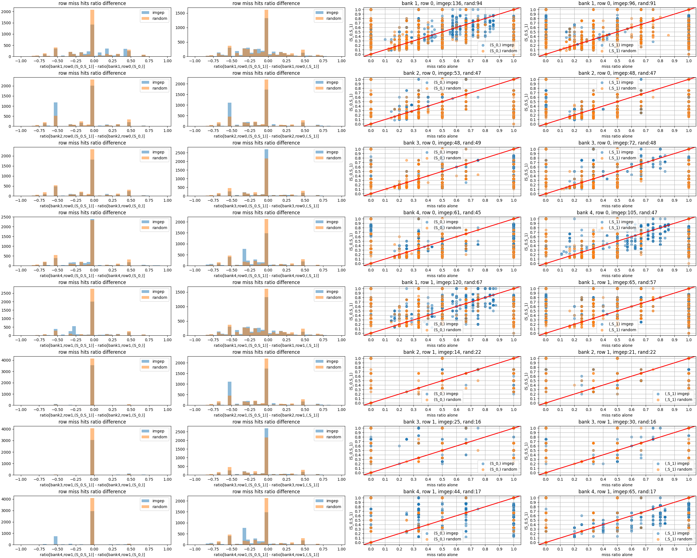

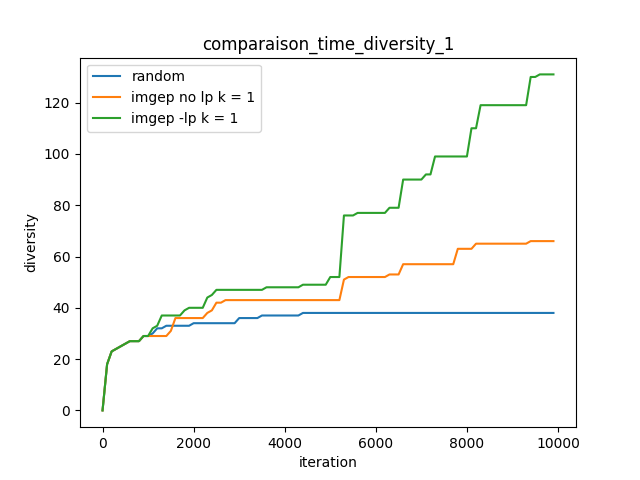


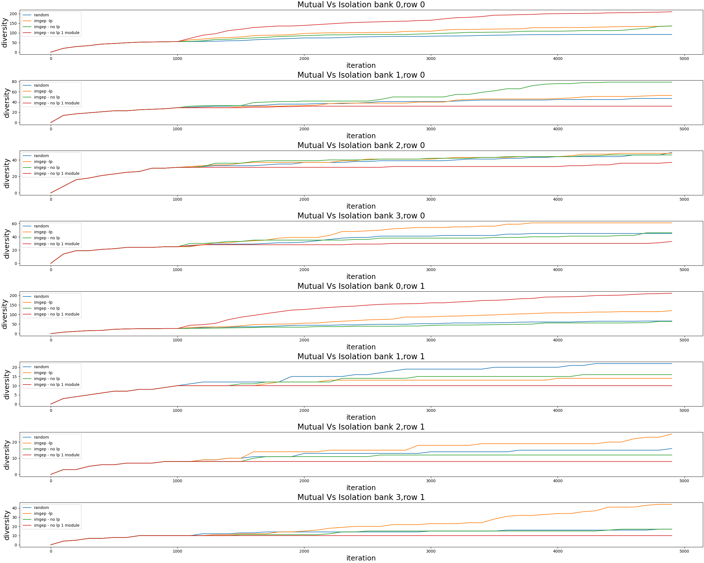
#### k = 2
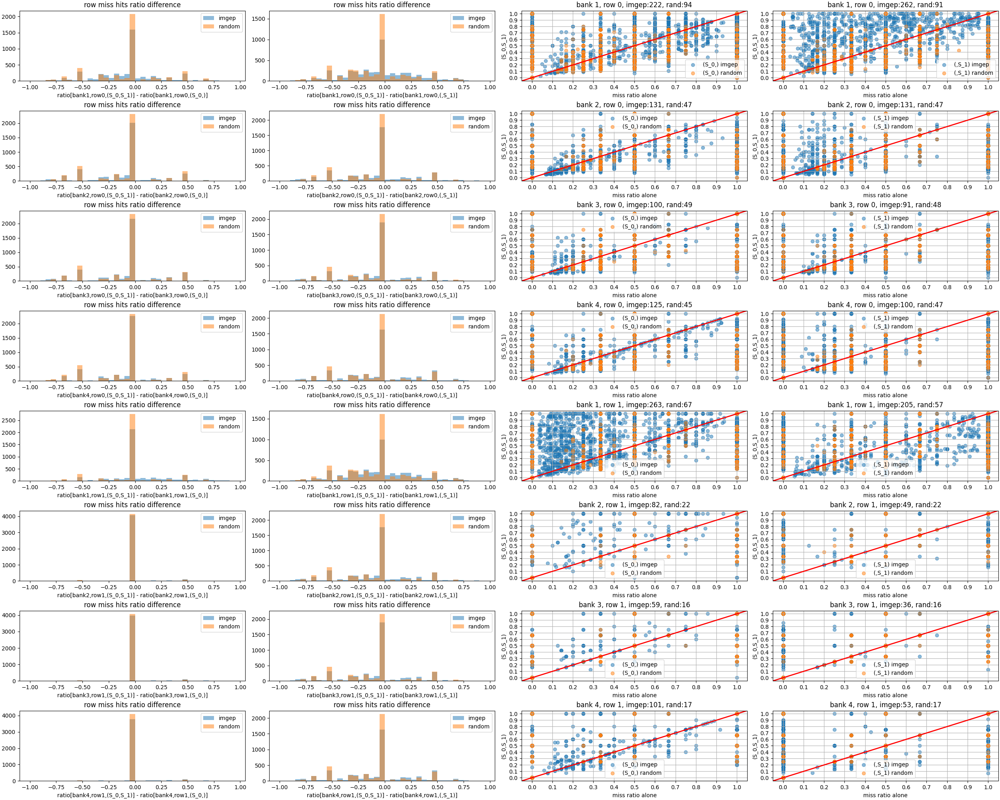
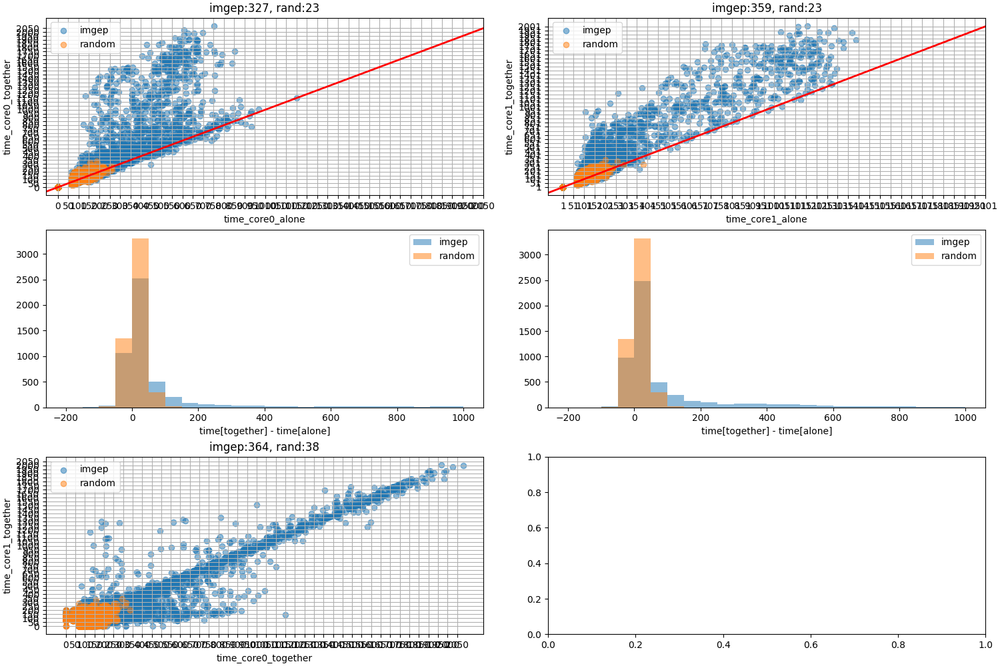
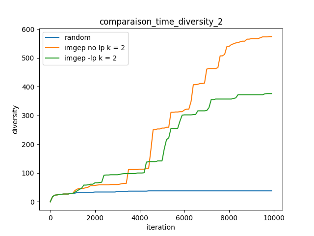

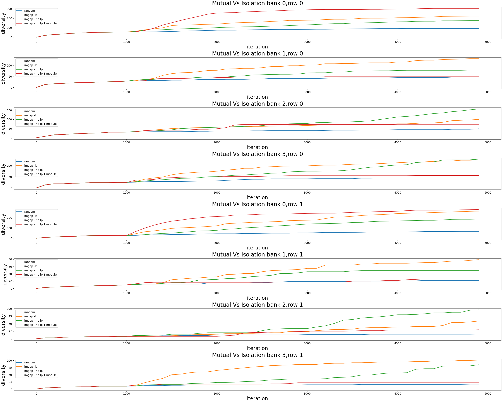
#### k = 3
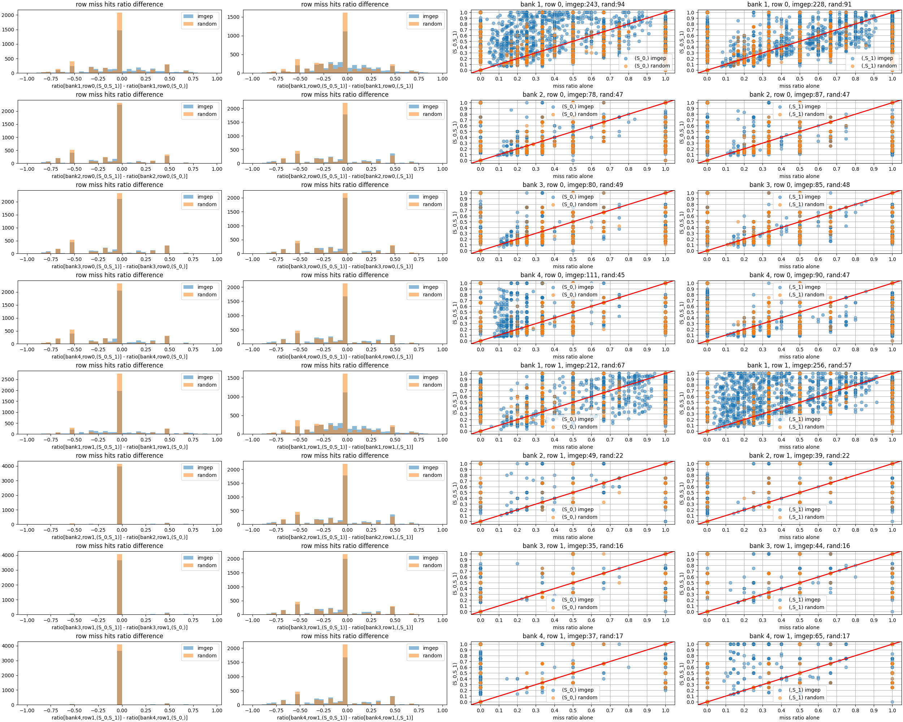
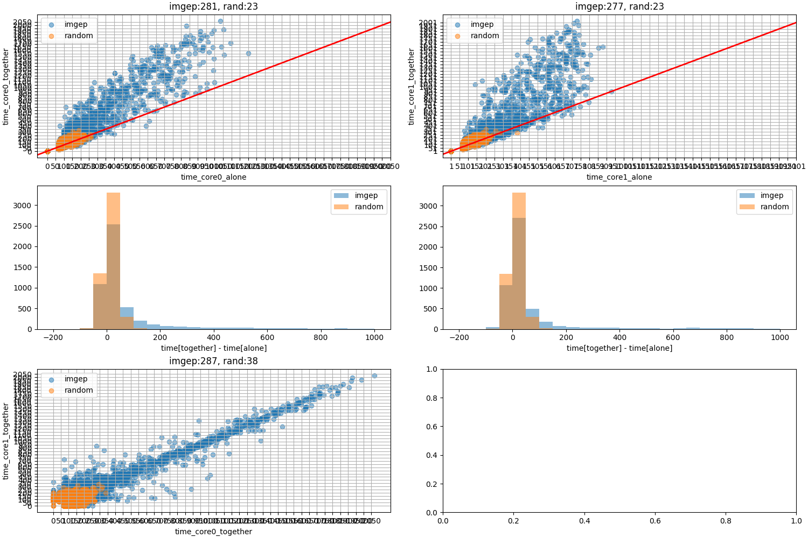
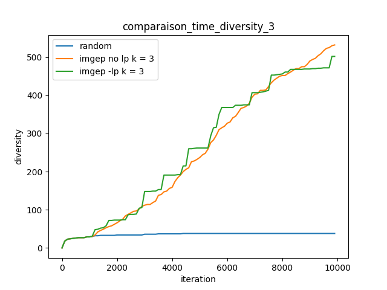

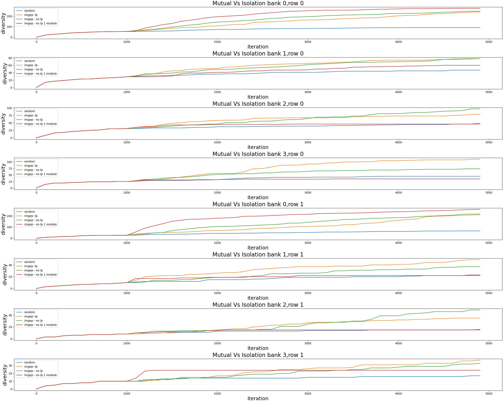
#### k = 4
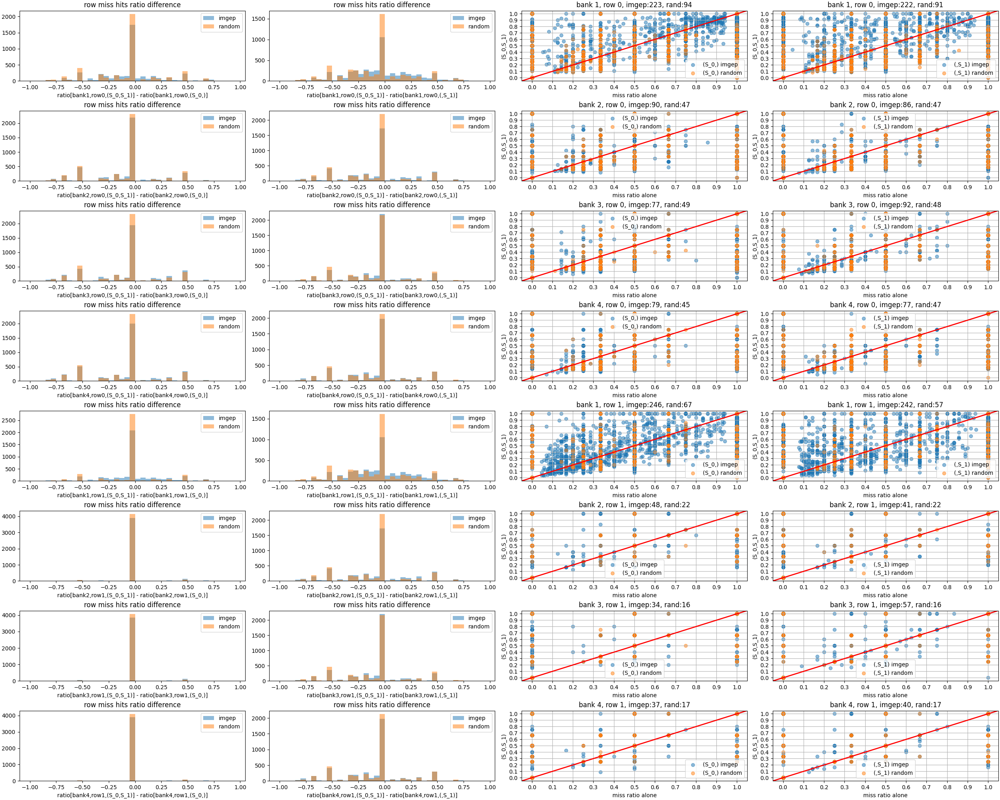
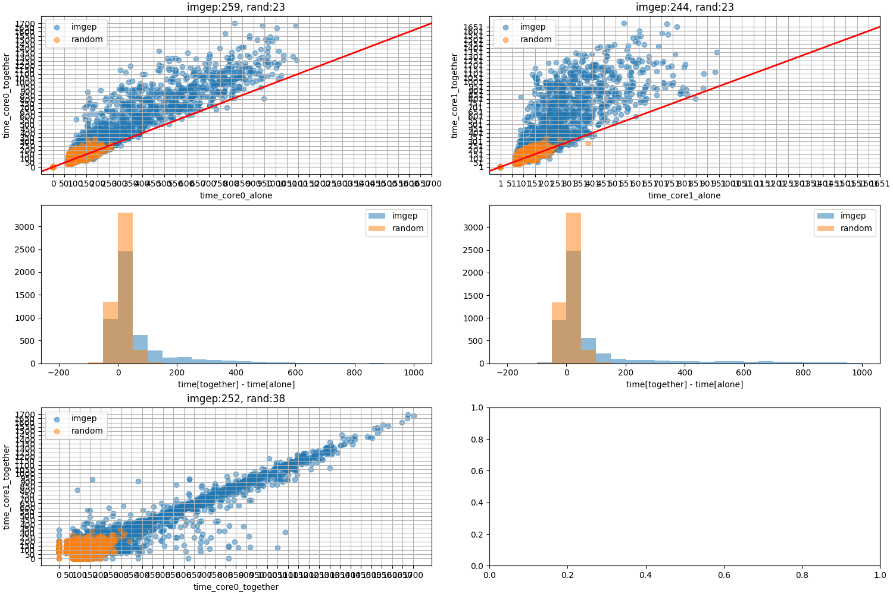
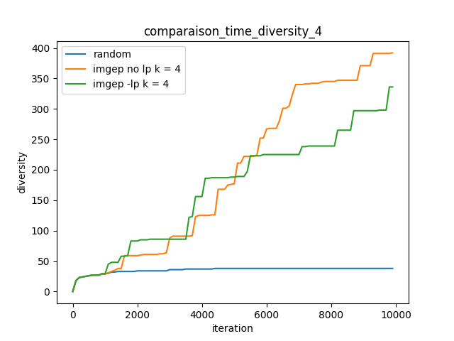
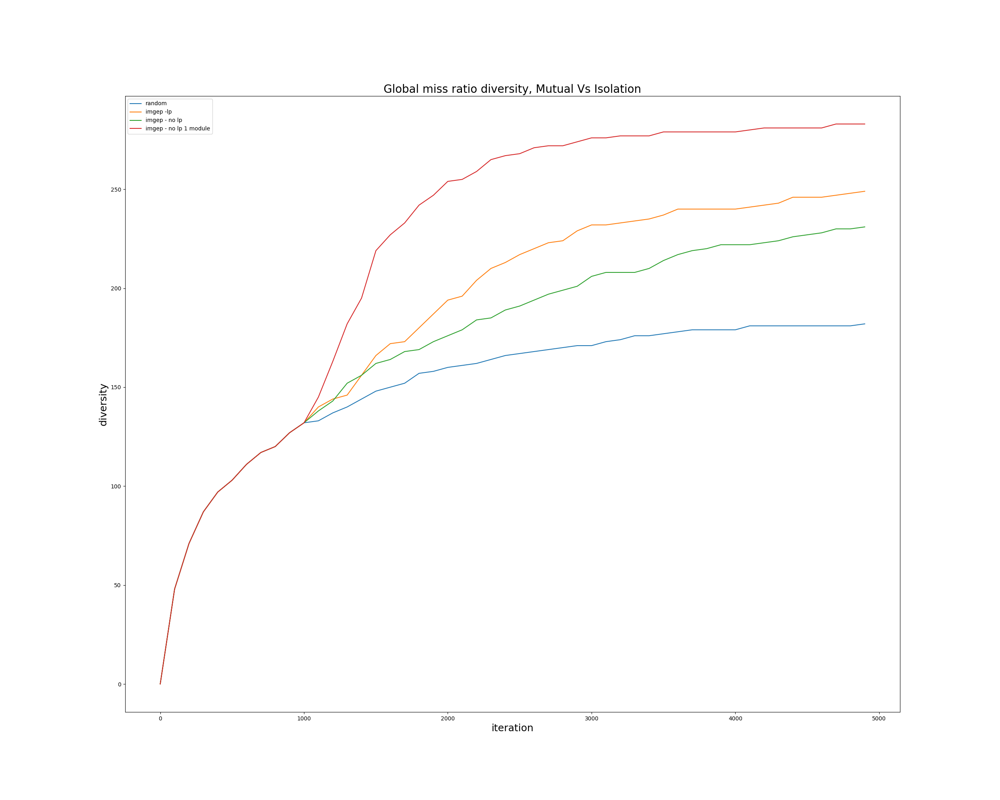
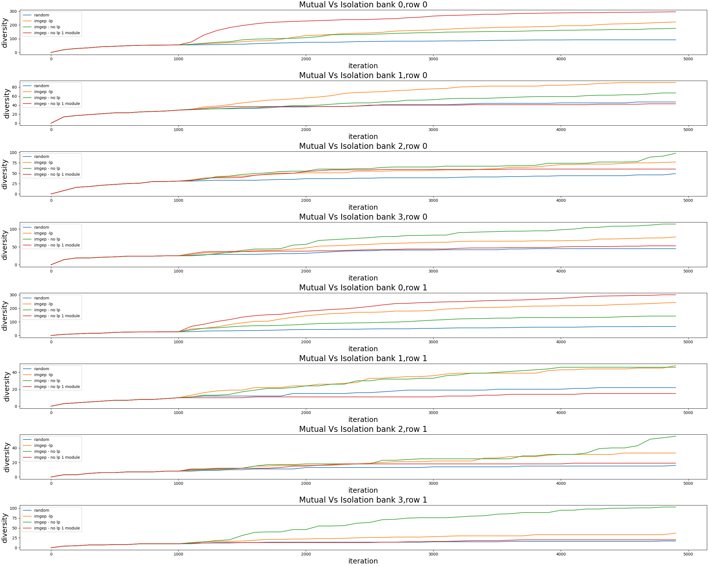
